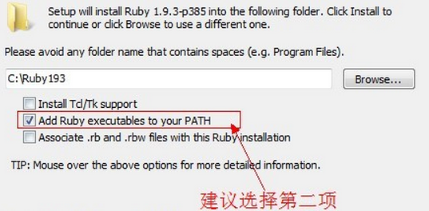

# Sass安装与基本使用

## 安装

### ruby安装

    -   因为sass依赖于ruby环境，所以装sass之前先确认装了ruby。先导官网下载个[ruby](http://rubyinstaller.org/downloads)
在安装的时候，请勾选Add Ruby executables to your PATH这个选项，添加环境变量，不然以后使用编译软件的时候会提示找不到ruby环境



### sass安装

-   sass安装安装完ruby之后，在开始菜单中，找到刚才我们安装的ruby，打开Start Command Prompt with Ruby安装完ruby之后，在开始菜单中找到


-   然后直接在命令行中输入

> gem install sass

-   按回车键确认，等待一段时间就会提示你sass安装成功。最近因为墙的比较厉害，如果你没有安装成功，那么请参考下面的淘宝的RubyGems镜像安装sass，如果成功则忽略。
-   如果要安装beta版本的，可以在命令行中输入

> gem install sass --pre

-   你还可以从sass的[Git repository](http://www.w3cplus.com/sassguide/github.com/nex3/sass)来安装，git命令为

>git clone git://github.com/nex3/sass.git
cd sass
rake install

-   升级sass版本的命令

> gem update sass

-   查看sass版本的命令行为

> sass -v

-   帮助

> sass -h

## 淘宝RubyGems径向安装sass

### 淘宝RubyGems镜像安装 sass

-   由于国内网络原因（你懂的），导致 rubygems.org 存放在 Amazon S3 上面的资源文件间歇性连接失败。这时候我们可以通过gem sources命令来配置源，先移除默认的https://rubygems.org源，然后添加淘宝的源https://ruby.taobao.org/，然后查看下当前使用的源是哪个，如果是淘宝的，则表示可以输入sass安装命令gem install sass了，关于常用gem source命令可参看:[常用的gem source](http://foyo99.zhuidaniu.com/blogs/687)

```js
    $ gem sources --remove https://rubygems.org/
    $ gem sources -a https://ruby.taobao.org/ 【如果你系统不支持https，请将淘宝源更换成：gem sources -a http://gems.ruby-china.org】
    $ gem sources -l
    *** CURRENT SOURCES ***

    https://ruby.taobao.org
    # 请确保只有 ruby.taobao.org
    $ gem install sass
```

-   如果上述方法不能正常安装的话，可以按下面录制的动画效果来安装


<br>
<a href="http://www.w3cplus.com/sassguide/sass-3.4.22.gem.zip">点击这里下载Sass安装文件</a>


## sass 的使用语法

### 文件后缀名
-   sass有两种后缀名文件：一种后缀名为sass，不使用大括号和分号；另一种就是我们这里使用的scss文件，这种和我们平时写的css文件格式差不多，使用大括号和分号。而本教程中所说的所有sass文件都指后缀名为scss的文件。在此也建议使用后缀名为scss的文件，以避免sass后缀名的严格格式要求报错。

```css
    /* 文件后缀名为sass的语法 */
    body
        background: #eee
        font-size:12px
    p
        background: #0982c1

    /* 文件后缀名为scss的语法 */  
    body {
    background: #eee;
        font-size:12px;
    }
    p{
        background: #0982c1;
    }
```

### 导入

-   sass的导入(@import)规则和CSS的有所不同，编译时会将@import的scss文件合并进来只生成一个CSS文件。但是如果你在sass文件中导入css文件如@import 'reset.css'，那效果跟普通CSS导入样式文件一样，导入的css文件不会合并到编译后的文件中，而是以@import方式存在。
所有的sass导入文件都可以忽略后缀名.scss。一般来说基础的文件命名方法以_开头，如_mixin.scss。这种文件在导入的时候可以不写下划线，可写成@import "mixin"。
<strong>被导入的sass文件a.scss</strong>

```css
    /* a.scss 
    ------------------------------- */
    body {
    background: #eee;
    }
```

<strong>需要导入样式的sass文件b.scss：</strong>

```css 
    @import "reset.css";
    @import "a";
    p{
    background: #0982c1;
    }
```

<strong>转译出来的b.css样式：</strong>

```css
    @import "reset.css";
    body {
    background: #eee;
    }
    p{
    background: #0982c1;
    }
```
-   根据上面的代码可以看出，b.scss编译后，reset.css继续保持import的方式，而a.scss则被整合进来了。

### 注释
-   sass有两种注释方式，一种是标准的css注释方式/* */，另一种则是//双斜杆形式的单行注释，不过这种单行注释不会被转译出来。

```css
    /*
    *我是css的标准注释
    *设置body内距
    */
    body{
    padding:5px;
    } 
```
```css
    //我是双斜杠表示的单行注释
    //设置body内距
    body{
    padding:5px; //5px
    } 
```

### 变量
-   sass的变量必须是$开头，后面紧跟变量名，而变量值和变量名之间就需要使用冒号(:)分隔开（就像CSS属性设置一样），如果值后面加上!default则表示默认值
<strong>不同变量</strong>  :定义之后可以在全局范围内使用。

```css
    //sass style
    //-------------------------------
    $fontSize: 12px;
    body{
        font-size:$fontSize;
    }

    //css style
    //-------------------------------
    body{
        font-size:12px;
    }
```

<strong>默认变量</strong>   ：sass的默认变量仅需要在值后面加上!default即可。

```css
//sass style
//-------------------------------
$baseLineHeight:        1.5 !default;
body{
    line-height: $baseLineHeight; 
}

//css style
//-------------------------------
body{
    line-height:1.5;
}
```

-   sass的默认变量一般是用来设置默认值，然后根据需求来覆盖的，覆盖的方式也很简单，只需要在默认变量之前重新声明下变量即可

```css
//sass style
//-------------------------------
$baseLineHeight:        2;
$baseLineHeight:        1.5 !default;
body{
    line-height: $baseLineHeight; 
}

//css style
//-------------------------------
body{
    line-height:2;
}
```
-   可以看出现在编译后的line-height为2，而不是我们默认的1.5。默认变量的价值在进行组件化开发的时候会非常有用。

### 直接跳过那些不常用的功能直接到函数吧
-   函数详情见：<a href="http://sass-lang.com/documentation/Sass/Script/Functions.html">sass函数使用</a>

-   less的函数可以参考这个博客  [水之原-less函数说明](http://www.cnblogs.com/zfc2201/p/3493335.html)